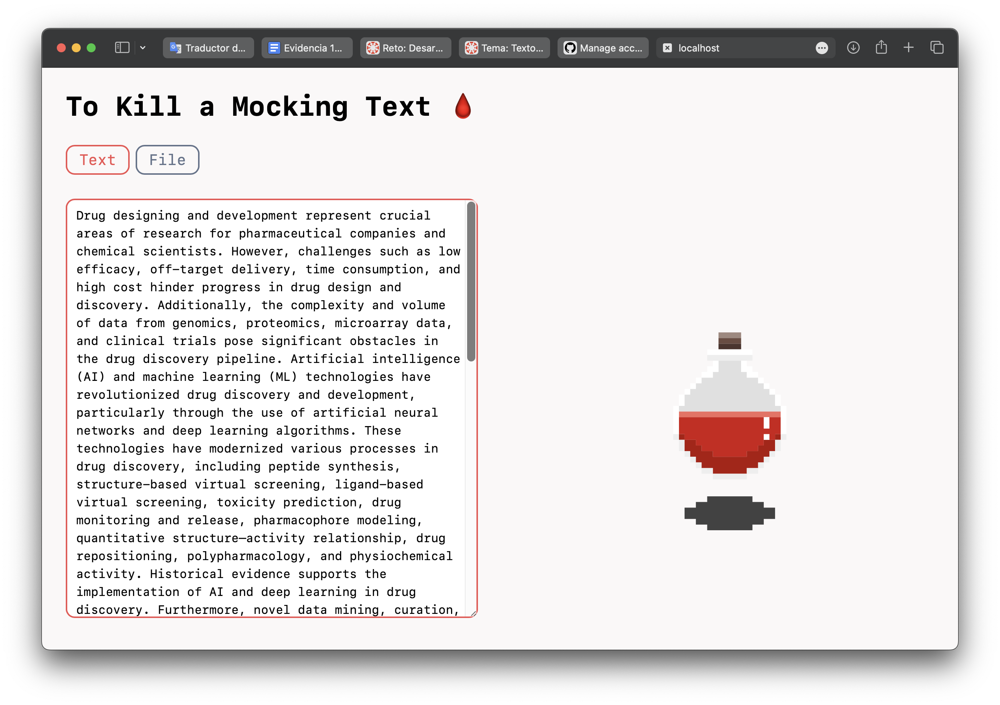

# To-Kill-A-Mocking-Text
Building a Fast Detector of Plagiarism and Similarity Between Scientific Abstracts

## Team
* Harumi Manzano 
* Adrian Bravo
* Sebastian Mora

## Getting Started 

1. Clone this repo into your computer.
2. Change directory to src 
`cd src`
3. Install de python dependencies. 
`pip install -r requirements.txt`
4. Run the main script or run the flask server. 
`python main.py || python server.py`

